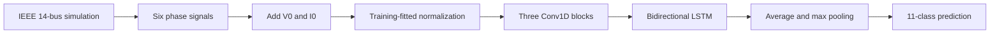

# Power-System Fault Classification Using Deep Learning

## [View the Project Portfolio →](https://sites.google.com/view/shakkya-gamage/home)

Classifying simulated power-system faults from three-phase voltage and current waveforms using a **3-CNN + BiLSTM** network.

This final-year electrical engineering project combines an IEEE 14-bus MATLAB/Simulink model, labelled waveform generation, and deep-learning experiments. Embedded relay integration is a project objective; field operation is not demonstrated here.

## At a glance

| Component | Configuration |
| --- | --- |
| Simulation | Author-selected `IEEE_14_Final.slx` from `Updated_14_Bus` |
| Measurement | Relay R1: `Va`, `Vb`, `Vc`, `Ia`, `Ib`, `Ic` |
| Input | 1,201 time steps x 8 channels, including `V0` and `I0` |
| Sampling | 6 kHz, 0.2-second training recordings |
| Network | Three Conv1D blocks followed by a bidirectional LSTM |
| Task | 11 fault classes; no healthy class in the recorded training run |
| Training data | 2,000 records: 1,280 training, 320 validation, 400 test |

## Workflow



See the [model specification](docs/model.md) and [dataset contract](docs/data.md) for architecture, labels, units, and simulation settings.

## Recorded results

These are saved experiment outputs, **not results reproduced from this checkout**. The historical Laxapana PDF and current Colab notebook contain different external evaluations.

| Evaluation source | Evaluated / attempted | Accuracy on evaluated records | Macro F1 |
| --- | ---: | ---: | ---: |
| Internal test, current notebook | 400 / 400 | 100.00% | Not separately recorded |
| Laxapana, archived PDF (2026-09-13) | 165 / 165 | 92.12% | 0.9225 |
| Indika, current notebook snapshot (2026-09-16) | 149 / 154 | 51.68% | 0.4724 |

For Indika, five recordings were rejected and correct predictions divided by all attempted recordings were **50.00%**. All 149 evaluated recordings used relative-position mapping without verified physical timing. These experiments do not establish field performance. Read [results and limitations](docs/results.md) before comparing scores.

## Repository layout

```text
notebooks/
  model_04.ipynb                Original Colab code, with outputs cleared
  README.md                    Setup and execution instructions
simulation/
  IEEE_14_Final.slx             Selected Simulink model
  generate_dataset.m           Portable adaptation of Gen_20.m
  README.md                    MATLAB setup and generation instructions
docs/
  model.md                     Architecture and training settings
  data.md                      Dataset contract and provenance
  results.md                   Experiment evidence and limitations
  source-manifest.json         Source provenance and original hashes
  archive/model_04_laxapana.pdf Historical notebook export
results/
  colab_2026-09-16_outputs.txt   Saved text output from current notebook
```

## Getting started

```bash
git clone https://github.com/ishakkya145/Fault-Classification.git
cd Fault-Classification
```

**Deep learning:** open [notebooks/model_04.ipynb](notebooks/model_04.ipynb) in Google Colab and follow [the notebook guide](notebooks/README.md). The original code cells are preserved. The notebook requires your training archive and an external evaluation source; datasets and trained checkpoints are not included.

**Simulation:** follow [the MATLAB guide](simulation/README.md). The model metadata records R2024a and uses Specialized Power Systems blocks. The generator defaults to 2,000 cases; start with a small case count to validate the environment.

The imported notebook has passed Python syntax checks. Full training, evaluation, and simulation have not been rerun during repository preparation. See the [reproducibility checklist](docs/reproducibility.md) and [roadmap](docs/roadmap.md) for remaining release work.

## Credits and licensing

Maintained by [Shakkya Gamage](https://github.com/ishakkya145), Electrical Engineering Student. Collaborator contributions and upstream simulation-model attribution remain to be documented; original SLX metadata is preserved.

A project license has not yet been selected. Existing `Previous Research Papers/` and `References/` folders contain third-party documents that retain their respective rights and need a citation/redistribution review.
